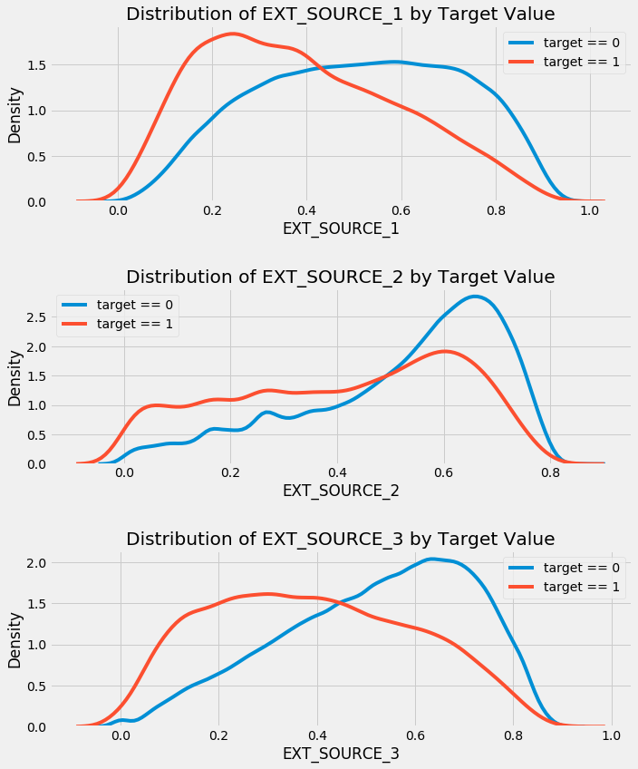
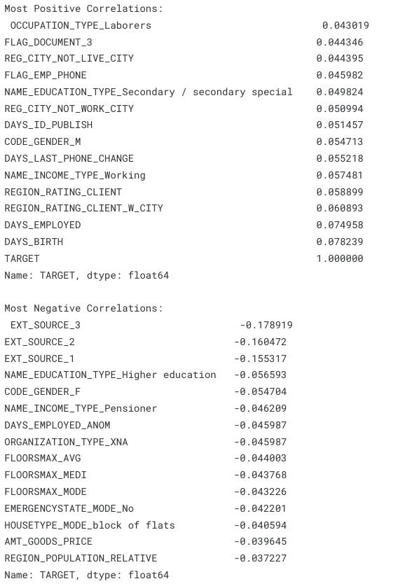
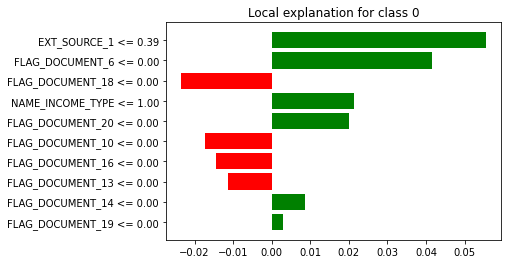
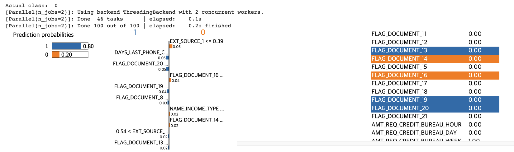
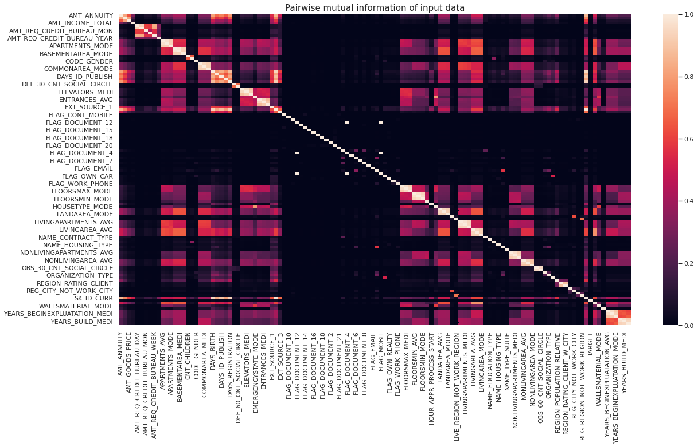
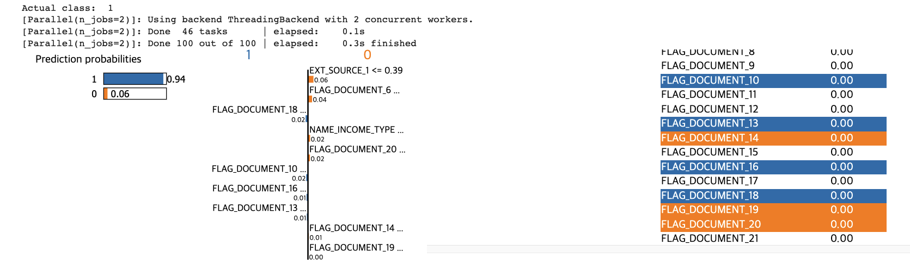

# Nutritional Labels for Automated Decision Systems by Home Credit Default Risk

**Responsible Data Science (DS_GA_1017)**  
_Final Report - Spring 2022_  
Authors: Wonkwon Lee (wl2733), Soowhan Park (sp6682)

## Overview
This project developed an Automated Decision System (ADS) to predict loan repayment probabilities using the Home Credit Default Risk dataset. The ADS focused on fairness and interpretability, applying machine learning models (Logistic Regression and Random Forest) with fairness and explainability tools such as AIF360 and LIME.

## Dataset
The dataset includes multiple files with loan applications, credit history, and client information. Key files:
- `application_train.csv` and `application_test.csv`: Loan application data with and without the target.
- `bureau.csv`: Data from the Credit Bureau on clients' past loans.

The target is imbalanced: far more loans are repaid than defaulted, introducing challenges to model accuracy.

## Models & Performance
We implemented Logistic Regression as a baseline and Random Forest for final analysis. Both models were evaluated for fairness across age, gender, and education. The Random Forest model achieved 67% accuracy. Although the ADS was unbiased across protected attributes, performance could be improved by addressing imbalanced data and incorporating external datasets.

## Key Insights
- **Fairness**: Minimal bias was observed for age, gender, or education.
- **Imbalance**: Addressing the target imbalance is crucial for improving accuracy.

### Figures
1. **EXT_SOURCE Distribution**  

1. **Most Positive and Negative Correlations**  

1. **Correctly Classified Example (LIME)**  

1. **Prediction Probabilities (Misclassified Example)**  

1. **Pairwise Mutual Information**  

1. **Prediction Probabilities (Classified Example)**  

## Conclusion
While the ADS demonstrates fair performance, its accuracy is limited by dataset imbalance and simplifications in preprocessing. Future improvements should focus on handling class imbalance and leveraging additional features.

## References
1. W. Koehrsen, "Start Here: A Gentle Introduction," Home Credit Default Risk Competition, 2018. [Online](https://www.kaggle.com/code/willkoehrsen/start-here-a-gentle-introduction/notebook)
2. Home_Credit, “Can You Predict How Capable Each Applicant Is of Repaying a Loan?” Home Credit Default Risk. [Online](https://www.kaggle.com/competitions/home-credit-default-risk/data)
